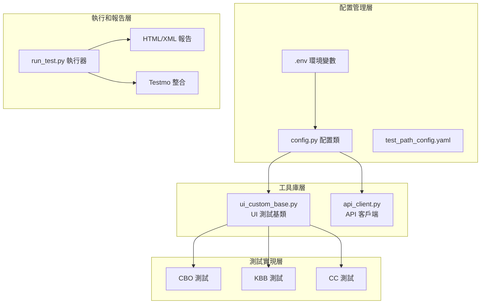

# EMB_automation 專案分析總結報告

## 執行摘要

### 專案整體評估

EMB_automation 是一個結構完整、功能豐富的多平台自動化測試框架，基於 SeleniumBase 和 pytest 構建。專案採用分層架構設計，支援 CBO、KBB、CC 等多個平台的 UI 和 API 測試，具備良好的可維護性和可擴展性。

### 主要發現和洞察

1. **架構設計優良**：採用清晰的分層架構，職責分離明確
2. **配置管理統一**：通過 [`config.py`](config.py:1) 和 [`.env`](.env:1) 實現集中化配置管理
3. **多平台支援完善**：支援三個主要平台的測試需求
4. **自動化程度高**：從測試執行到報告生成的完整自動化流程
5. **工具整合良好**：整合 Testmo、郵件通知等第三方服務

### 關鍵優勢和風險點

#### 關鍵優勢 ✅
- **統一的測試基類**：[`libs/ui_custom_base.py`](libs/ui_custom_base.py:1) 提供豐富的通用方法
- **靈活的配置系統**：支援多環境、多模式動態切換
- **完整的報告機制**：HTML 報告、XML 報告、Testmo 整合
- **良好的錯誤處理**：包含截圖、日誌記錄等除錯功能

#### 主要風險點 ⚠️
- **單點故障風險**：[`config.py`](config.py:1) 和 [`ui_custom_base.py`](libs/ui_custom_base.py:1) 故障影響範圍大
- **高耦合度**：配置模組與測試檔案間存在強耦合關係
- **依賴集中化**：核心依賴過於集中，缺乏容錯機制

### 建議改進方向

1. **降低耦合度**：引入配置介面層，實現依賴注入
2. **增強錯誤處理**：添加配置驗證和優雅降級機制
3. **提升可觀測性**：增加性能監控和健康檢查
4. **安全性增強**：敏感資訊加密存儲和存取控制

---

## 專案概覽

### 專案目的和範圍

EMB_automation 專案旨在為 EMB 公司的多個業務平台提供統一的自動化測試解決方案，涵蓋：

- **CBO 平台**：核心業務系統的 UI 和 API 測試
- **KBB 平台**：知識庫系統的功能驗證
- **CC 平台**：客服系統的 Company 和 Agent 端測試

### 技術架構總覽



### 主要功能模組

1. **配置管理模組**
   - 環境變數管理（[`.env`](.env:1)）
   - 動態配置生成（[`config.py`](config.py:1)）
   - 測試路徑配置（[`test_path_config.yaml`](test_path_config.yaml:1)）

2. **測試執行模組**
   - UI 測試基類（[`libs/ui_custom_base.py`](libs/ui_custom_base.py:1)）
   - API 客戶端（[`libs/api_client.py`](libs/api_client.py:1)）
   - 測試執行器（[`run_test.py`](run_test.py:1)）

3. **報告和通知模組**
   - HTML/XML 報告生成
   - Testmo 平台整合
   - 郵件通知系統

### 支援的平台和環境

#### 支援平台
- **CBO**：完整的 UI 和 API 測試支援
- **KBB**：UI 和 API 測試功能
- **CC**：Company 和 Agent 端測試

#### 支援環境
- **UAT 環境**：使用者驗收測試環境
- **STG 環境**：預發布測試環境
- **多瀏覽器支援**：Chrome、Firefox、Edge

---

## 架構分析總結

### 設計模式和架構原則

#### 採用的設計模式

1. **配置模式（Configuration Pattern）**
   - 實現：[`config.py`](config.py:1) 集中管理所有配置
   - 優點：統一配置管理，環境切換方便
   - 應用：環境變數、URL、帳號密碼管理

2. **模板方法模式（Template Method Pattern）**
   - 實現：[`ui_custom_base.py`](libs/ui_custom_base.py:1) 提供測試模板
   - 優點：統一測試流程，減少重複代碼
   - 應用：登入、登出、截圖等通用操作

3. **工廠模式（Factory Pattern）**
   - 實現：[`config.py`](config.py:1) 的 URL 建構方法
   - 優點：動態創建不同環境的配置
   - 應用：[`build_ui_url()`](config.py:77)、[`build_api_url()`](config.py:96)

4. **策略模式（Strategy Pattern）**
   - 實現：不同平台的測試策略
   - 優點：支援多平台，易於擴展
   - 應用：CBO、KBB、CC 平台差異化處理

#### 遵循的架構原則

1. **單一職責原則（SRP）** ✅
   - [`config.py`](config.py:1)：僅負責配置管理
   - [`ui_custom_base.py`](libs/ui_custom_base.py:1)：僅負責 UI 測試基礎功能
   - [`api_client.py`](libs/api_client.py:1)：僅負責 API 請求封裝

2. **開放封閉原則（OCP）** ✅
   - 通過繼承 CustomBase 擴展新的測試功能
   - 通過配置檔案添加新的測試路徑
   - 通過環境變數支援新的環境

3. **依賴倒置原則（DIP）** ⚠️
   - 測試檔案依賴抽象的 CustomBase
   - 但配置依賴仍較為直接，有改進空間

### 模組化程度評估

#### 高模組化區域 ✅
- **工具庫層**：[`libs/`](libs/) 目錄下的工具類設計良好
- **測試層**：按平台和類型清晰分類
- **配置層**：職責明確，介面清晰

#### 待改進區域 ⚠️
- **配置耦合**：測試檔案對配置類的直接依賴較強
- **平台特定邏輯**：部分平台特定代碼可進一步抽象

### 可擴展性分析

#### 擴展優勢 ✅
1. **新平台添加**：通過配置和基類擴展支援新平台
2. **新測試類型**：基於現有基類可快速開發新測試
3. **新環境支援**：通過環境變數輕鬆添加新環境

#### 擴展挑戰 ⚠️
1. **配置複雜度**：新平台需要修改多個配置點
2. **基類膨脹**：隨著平台增加，基類可能變得過於複雜
3. **測試路徑管理**：YAML 配置可能變得難以維護

### 維護性評估

#### 維護優勢 ✅
- **集中式配置**：配置變更影響範圍可控
- **統一的測試基類**：通用功能修改一次即可
- **清晰的目錄結構**：易於定位和修改代碼

#### 維護挑戰 ⚠️
- **單點故障風險**：核心檔案故障影響範圍大
- **配置複雜性**：多環境、多平台配置容易出錯
- **依賴管理**：版本升級可能影響多個模組

---

## 檔案結構總覽

### 核心檔案清單和功能

#### 配置檔案
| 檔案 | 功能 | 重要性 | 維護頻率 |
|------|------|--------|----------|
| [`.env`](.env:1) | 環境變數和敏感資訊 | ★★★★★ | 中等 |
| [`config.py`](config.py:1) | 核心配置類和 URL 生成 | ★★★★★ | 低 |
| [`test_path_config.yaml`](test_path_config.yaml:1) | 測試路徑配置 | ★★★☆☆ | 中等 |
| [`pytest.ini`](pytest.ini:1) | Pytest 配置 | ★★☆☆☆ | 低 |

#### 工具庫檔案
| 檔案 | 功能 | 重要性 | 維護頻率 |
|------|------|--------|----------|
| [`libs/ui_custom_base.py`](libs/ui_custom_base.py:1) | UI 測試基類 | ★★★★★ | 中等 |
| [`libs/api_client.py`](libs/api_client.py:1) | API 客戶端 | ★★★☆☆ | 低 |

#### 執行檔案
| 檔案 | 功能 | 重要性 | 維護頻率 |
|------|------|--------|----------|
| [`run_test.py`](run_test.py:1) | 測試執行器 | ★★★★☆ | 中等 |

### 依賴關係摘要

#### 核心依賴鏈
```
.env → config.py → ui_custom_base.py → 測試檔案
```

#### 執行依賴鏈
```
test_path_config.yaml → run_test.py → pytest → 測試檔案
```

#### 報告依賴鏈
```
run_test.py → HTML/XML 報告 → Testmo → 郵件通知
```

### 關鍵路徑識別

#### 主要執行路徑 🔥
1. **配置載入路徑**：[`.env`](.env:1) → [`config.py`](config.py:1) → 環境判斷 → 動態配置載入
2. **UI 測試路徑**：[`config.py`](config.py:1) → [`ui_custom_base.py`](libs/ui_custom_base.py:1) → UI 測試檔案
3. **測試執行路徑**：[`run_test.py`](run_test.py:1) → [`test_path_config.yaml`](test_path_config.yaml:1) → pytest → 測試檔案

#### 次要支援路徑
1. **API 測試路徑**：[`config.py`](config.py:1) → [`api_client.py`](libs/api_client.py:1) → API 測試檔案
2. **報告生成路徑**：測試結果 → HTML/XML 報告 → Testmo 上傳

### 風險點分析

#### 高風險檔案 🚨
1. **[`config.py`](config.py:1)**
   - 風險：配置錯誤導致所有測試失敗
   - 影響範圍：整個系統
   - 緩解措施：增加配置驗證和預設值處理

2. **[`.env`](.env:1)**
   - 風險：環境變數缺失或格式錯誤
   - 影響範圍：環境相關功能
   - 緩解措施：環境變數驗證和錯誤處理

3. **[`ui_custom_base.py`](libs/ui_custom_base.py:1)**
   - 風險：基類方法錯誤影響所有 UI 測試
   - 影響範圍：所有 UI 測試
   - 緩解措施：完善的單元測試和版本控制

#### 中風險檔案 ⚠️
1. **[`run_test.py`](run_test.py:1)**
   - 風險：執行器故障影響測試執行
   - 影響範圍：測試執行流程
   - 緩解措施：錯誤處理和日誌記錄

2. **[`test_path_config.yaml`](test_path_config.yaml:1)**
   - 風險：路徑配置錯誤導致測試無法執行
   - 影響範圍：測試路徑選擇
   - 緩解措施：路徑驗證和預設配置

---

## 使用指南摘要

### 快速上手步驟

#### 1. 環境準備（5 分鐘）
```bash
# 安裝依賴
pip install -r requirements.txt

# 配置環境變數
cp .env.example .env
# 編輯 .env 檔案設定必要配置

# 驗證安裝
python -c "from config import TestConfig; print('配置載入成功')"
```

#### 2. 執行測試（1 分鐘）
```bash
# 執行所有測試
python run_test.py

# 執行特定平台測試
TEST_MODE=cbo python run_test.py

# 指定環境執行
ENVIRONMENT=uat python run_test.py
```

#### 3. 查看結果（1 分鐘）
```bash
# 查看 HTML 報告
open reports/report_YYYYMMDD_HHMMSS.html

# 查看 Testmo 報告（執行完成後會顯示 URL）
```

### 常見使用場景

#### 日常回歸測試
```bash
TEST_MODE=all ENVIRONMENT=uat python run_test.py
```

#### 新功能驗證
```bash
TEST_MODE=ui ENVIRONMENT=stg python run_test.py
```

#### API 介面測試
```bash
TEST_MODE=api ENVIRONMENT=stg python run_test.py
```

#### 特定平台測試
```bash
TEST_MODE=cbo ENVIRONMENT=uat python run_test.py
```

### 最佳實踐建議

#### 測試執行最佳實踐 ✅
1. **環境隔離**：不同環境使用不同的配置
2. **測試分類**：根據測試類型選擇合適的執行模式
3. **並行執行**：使用 pytest-xdist 提高執行效率
4. **定期執行**：建立定時任務進行回歸測試

#### 配置管理最佳實踐 ✅
1. **敏感資訊保護**：不要將 [`.env`](.env:1) 提交到版本控制
2. **配置驗證**：執行前驗證必要配置是否完整
3. **環境一致性**：確保不同環境的配置格式一致
4. **備份重要配置**：定期備份配置檔案

### 故障排除要點

#### 常見問題快速解決 🔧
1. **環境變數錯誤**：檢查 [`.env`](.env:1) 檔案和 `ENVIRONMENT` 設定
2. **瀏覽器驅動問題**：使用 `seleniumbase install chromedriver`
3. **元素定位失敗**：增加等待時間或使用更穩定的選擇器
4. **Testmo 上傳失敗**：檢查 CLI 安裝和權限設定

---

## 改進建議

### 架構優化建議

#### 1. 降低耦合度 🎯
**現狀問題**：
- 測試檔案直接依賴 [`config.py`](config.py:1)
- 配置變更影響所有測試檔案

**改進方案**：
```python
# 引入配置介面層
class ConfigInterface:
    @abstractmethod
    def get_login_url(self, platform: str) -> str:
        pass
    
    @abstractmethod
    def get_credentials(self, platform: str) -> dict:
        pass

# 實現依賴注入
class TestBase:
    def __init__(self, config: ConfigInterface):
        self.config = config
```

#### 2. 模組化重構 🔄
**現狀問題**：
- [`ui_custom_base.py`](libs/ui_custom_base.py:1) 過於龐大
- 平台特定邏輯混雜

**改進方案**：
```python
# 按功能拆分基類
libs/
├── base/
│   ├── ui_base.py          # 基礎 UI 操作
│   ├── screenshot_mixin.py # 截圖功能
│   └── login_mixin.py      # 登入功能
├── platforms/
│   ├── cbo_handler.py      # CBO 平台處理
│   ├── kbb_handler.py      # KBB 平台處理
│   └── cc_handler.py       # CC 平台處理
```

### 程式碼品質提升

#### 1. 增加單元測試 🧪
**目標**：提升代碼可靠性和維護性

**實施計劃**：
```python
# tests/unit/
├── test_config.py          # 配置類測試
├── test_ui_base.py         # UI 基類測試
└── test_api_client.py      # API 客戶端測試

# 範例測試
class TestConfig:
    def test_build_ui_url_cbo(self):
        url = TestConfig.build_ui_url("login", "CBO")
        assert url.startswith("https://")
        assert "cbo" in url.lower()
```

#### 2. 程式碼規範化 📏
**實施工具**：
```bash
# 安裝程式碼品質工具
pip install black flake8 mypy pre-commit

# 配置 pre-commit
# .pre-commit-config.yaml
repos:
  - repo: https://github.com/psf/black
    hooks:
      - id: black
  - repo: https://github.com/PyCQA/flake8
    hooks:
      - id: flake8
```

### 測試覆蓋率改善

#### 1. 增加 API 測試覆蓋 📊
**現狀**：API 測試相對較少
**目標**：達到 80% API 覆蓋率

**實施計劃**：
- 為每個平台添加完整的 API 測試套件
- 包含正常流程和異常情況測試
- 添加 API 回應格式驗證

#### 2. 增加邊界條件測試 🔍
**實施範圍**：
- 網路異常處理測試
- 超時情況測試
- 無效輸入處理測試
- 權限邊界測試

### 文件完善建議

#### 1. API 文件化 📚
**目標**：為所有公開方法提供完整文件

**實施方案**：
```python
def login(self, platform: str, user_id: str = None, 
          password: str = None, is_admin: bool = False) -> bool:
    """
    執行平台登入操作
    
    Args:
        platform: 平台名稱 (CBO/KBB/CCCOMPANY/CCAGENT)
        user_id: 使用者 ID，預設使用配置中的值
        password: 密碼，預設使用配置中的值
        is_admin: 是否使用管理員帳號
        
    Returns:
        bool: 登入是否成功
        
    Raises:
        ValueError: 當平台不支援時
        TimeoutException: 當登入超時時
        
    Example:
        >>> self.login("CBO")
        True
        >>> self.login("CBO", "custom_user", "custom_pass")
        True
    """
```

#### 2. 故障排除指南擴充 🛠️
**新增內容**：
- 常見錯誤代碼對照表
- 效能調優指南
- 監控和告警設置
- 災難恢復程序

---

## 結論

### 專案整體評價

EMB_automation 專案是一個**設計良好、功能完整**的自動化測試框架，具有以下特點：

#### 優勢總結 ✅
1. **架構清晰**：採用分層架構，職責分離明確
2. **功能豐富**：支援多平台、多環境、多類型測試
3. **工具整合**：良好整合 Testmo、郵件通知等工具
4. **易於使用**：提供簡潔的執行介面和豐富的配置選項
5. **可維護性**：代碼結構清晰，便於理解和修改

#### 改進空間 ⚠️
1. **耦合度控制**：需要進一步降低模組間的耦合度
2. **錯誤處理**：需要增強配置驗證和異常處理機制
3. **測試覆蓋**：需要增加單元測試和邊界條件測試
4. **文件完善**：需要補充 API 文件和故障排除指南

### 未來發展方向

#### 短期目標（1-3 個月）
1. **降低耦合度**：實現配置介面層和依賴注入
2. **增加單元測試**：為核心模組添加單元測試
3. **程式碼規範化**：引入程式碼品質工具和規範

#### 中期目標（3-6 個月）
1. **模組化重構**：拆分大型類別，提高模組化程度
2. **效能優化**：優化測試執行效率和資源使用
3. **監控增強**：添加效能監控和健康檢查機制

#### 長期目標（6-12 個月）
1. **雲端化部署**：支援容器化部署和雲端執行
2. **AI 輔助測試**：引入 AI 技術提升測試智能化
3. **持續整合**：完善 CI/CD 流程整合

### 維護重點

#### 日常維護 🔄
1. **定期更新依賴**：保持套件版本更新
2. **監控測試穩定性**：及時修復不穩定的測試
3. **配置管理**：確保環境配置的一致性和安全性

#### 重點關注 🎯
1. **核心檔案監控**：重點關注 [`config.py`](config.py:1) 和 [`ui_custom_base.py`](libs/ui_custom_base.py:1) 的變更
2. **效能監控**：監控測試執行時間和資源使用情況
3. **安全性檢查**：定期檢查敏感資訊的安全性

#### 擴展準備 🚀
1. **新平台支援**：為新平台添加做好架構準備
2. **新技術整合**：關注新的測試技術和工具
3. **團隊協作**：建立良好的團隊協作和知識分享機制

---

**總結報告完成時間**：2025年7月16日  
**報告版本**：v1.0  
**分析範圍**：EMB_automation 專案完整架構和檔案  
**建議實施優先級**：高優先級（架構優化）→ 中優先級（品質提升）→ 低優先級（功能擴展）