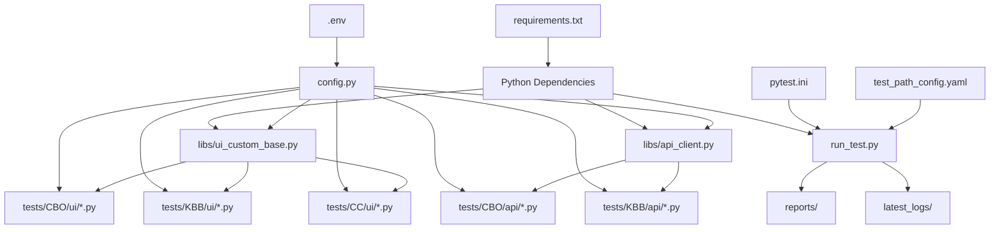
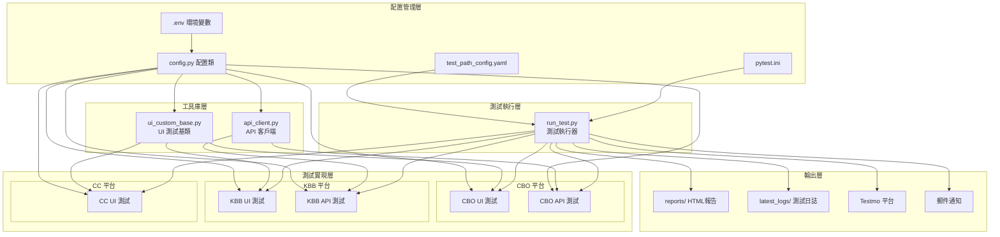
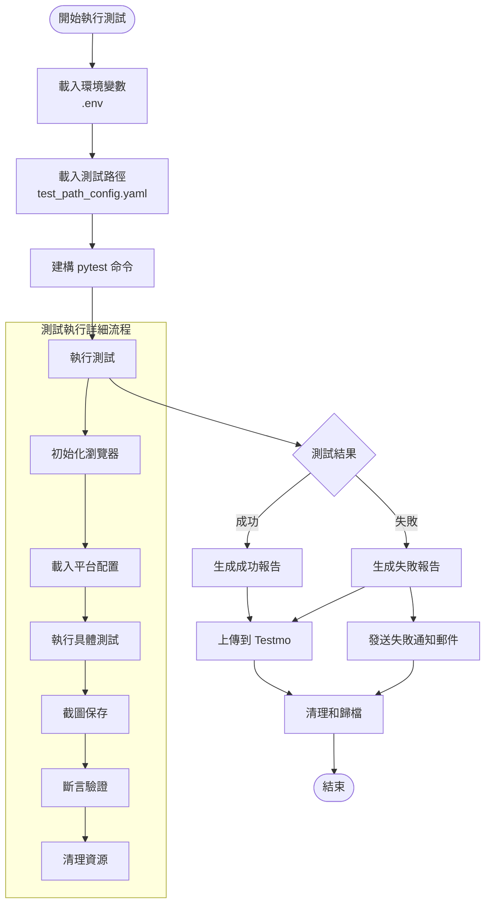
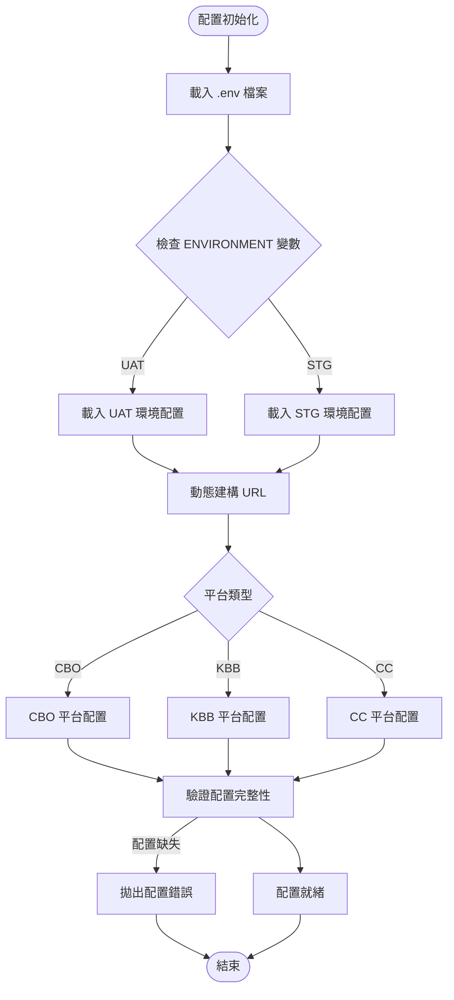
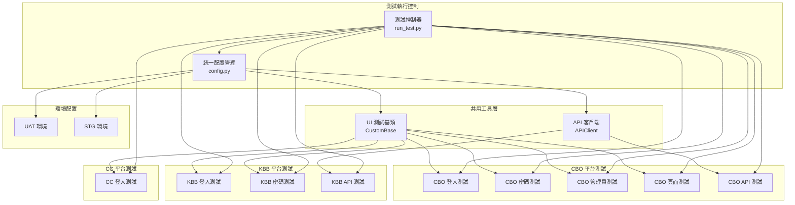
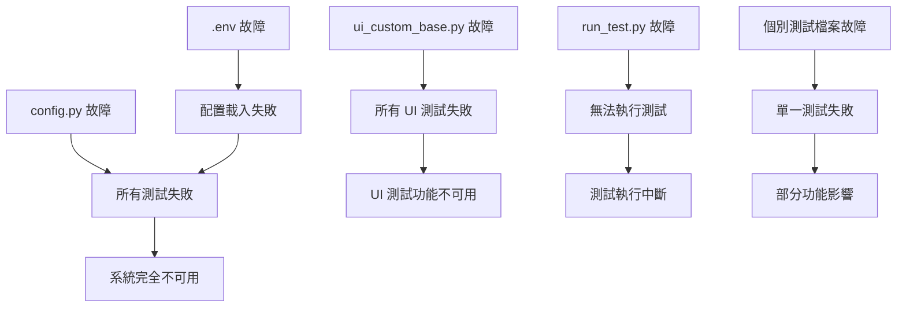

# EMB_automation 專案架構分析報告

## 1. 專案概述

EMB_automation 是一個基於 SeleniumBase 的多平台自動化測試框架，支援 CBO、KBB、CC 等多個平台的 UI 和 API 測試。

### 1.1 專案結構層次
```
EMB_automation/
├── 配置層：環境變數、測試路徑、pytest 配置
├── 工具庫層：UI 自定義基類、API 客戶端
├── 測試層：CBO、KBB、CC 平台的 UI/API 測試
├── 執行層：測試執行器和報告生成
└── 日誌層：測試結果和截圖存儲
```

## 2. 檔案依賴關係分析

### 2.1 核心依賴關係圖



### 2.2 Import 依賴分析

#### 配置層依賴
- **config.py**: 
  - 依賴：`os`, `dotenv.load_dotenv`
  - 被依賴：所有測試檔案、ui_custom_base.py

#### 工具庫層依賴
- **libs/ui_custom_base.py**:
  - 依賴：`seleniumbase.BaseCase`, `config.TestConfig`, `selenium`, `datetime`, `dotenv`, `os`, `sys`, `re`, `inspect`
  - 被依賴：所有 UI 測試檔案

- **libs/api_client.py**:
  - 依賴：`requests`
  - 被依賴：API 測試檔案（間接使用）

#### 測試層依賴
- **UI 測試檔案**:
  - 共同依賴：`os`, `config.TestConfig`, `libs.ui_custom_base.CustomBase`
  
- **API 測試檔案**:
  - 共同依賴：`seleniumbase.BaseCase`, `requests`, `config.TestConfig`

#### 執行層依賴
- **run_test.py**:
  - 依賴：`datetime`, `os`, `smtplib`, `subprocess`, `re`, `email.mime.text`, `getpass`, `dotenv`, `yaml`

## 3. 系統架構圖

### 3.1 整體系統架構



### 3.2 測試執行流程圖



### 3.3 配置管理流程圖



### 3.4 多平台測試架構圖



## 4. 檔案間影響關係矩陣

### 4.1 依賴關係矩陣

| 檔案/模組 | .env | config.py | ui_custom_base.py | api_client.py | run_test.py | 測試檔案 |
|-----------|------|-----------|-------------------|---------------|-------------|----------|
| .env | - | ✓ | - | - | ✓ | - |
| config.py | ✓ | - | ✓ | - | - | ✓ |
| ui_custom_base.py | - | ✓ | - | - | - | ✓ |
| api_client.py | - | - | - | - | - | ✓ |
| run_test.py | ✓ | - | - | - | - | ✓ |
| 測試檔案 | - | ✓ | ✓ | ✓ | - | - |

### 4.2 影響程度分析

#### 高影響檔案（核心依賴）
1. **config.py** - 影響度：★★★★★
   - 被所有測試檔案依賴
   - 配置變更影響整個系統
   - 單點故障風險高

2. **.env** - 影響度：★★★★☆
   - 環境配置的唯一來源
   - 變更影響所有環境相關功能
   - 敏感資訊集中管理

3. **ui_custom_base.py** - 影響度：★★★★☆
   - 所有 UI 測試的基礎類
   - 方法變更影響所有 UI 測試
   - 功能擴展的核心位置

#### 中影響檔案
4. **run_test.py** - 影響度：★★★☆☆
   - 測試執行的入口點
   - 主要影響執行流程和報告生成

5. **test_path_config.yaml** - 影響度：★★★☆☆
   - 影響測試路徑選擇
   - 變更影響測試執行範圍

#### 低影響檔案
6. **api_client.py** - 影響度：★★☆☆☆
   - 僅影響 API 測試
   - 相對獨立的工具類

7. **個別測試檔案** - 影響度：★☆☆☆☆
   - 影響範圍限於單一測試功能

## 5. 耦合度分析

### 5.1 高耦合模組識別

#### 強耦合關係
1. **config.py ↔ 所有測試檔案**
   - 耦合類型：資料耦合
   - 風險：配置變更影響所有測試
   - 建議：引入配置介面層

2. **ui_custom_base.py ↔ UI 測試檔案**
   - 耦合類型：繼承耦合
   - 風險：基類變更影響所有 UI 測試
   - 建議：穩定基類介面

#### 中度耦合關係
3. **.env ↔ config.py**
   - 耦合類型：資料耦合
   - 風險：環境變數變更需同步更新配置邏輯

4. **run_test.py ↔ test_path_config.yaml**
   - 耦合類型：資料耦合
   - 風險：路徑配置格式變更影響執行器

### 5.2 低耦合模組識別

#### 良好解耦的模組
1. **api_client.py**
   - 獨立的工具類
   - 僅提供 HTTP 請求封裝
   - 可重用性高

2. **個別測試檔案間**
   - 測試檔案間無直接依賴
   - 良好的測試隔離性

## 6. 關鍵路徑和風險分析

### 6.1 關鍵路徑識別

#### 主要執行路徑
```
.env → config.py → ui_custom_base.py → UI測試檔案 → 測試結果
```

#### 配置載入路徑
```
.env → config.py → 環境判斷 → 動態配置載入 → 測試執行
```

#### 測試執行路徑
```
run_test.py → test_path_config.yaml → pytest → 測試檔案 → 報告生成
```

### 6.2 單點故障風險

#### 高風險單點
1. **config.py**
   - 風險：配置類錯誤導致所有測試失敗
   - 緩解：增加配置驗證和預設值處理

2. **.env 檔案**
   - 風險：環境變數缺失或格式錯誤
   - 緩解：環境變數驗證和錯誤處理

3. **ui_custom_base.py**
   - 風險：基類方法錯誤影響所有 UI 測試
   - 緩解：完善的單元測試和版本控制

#### 中風險單點
4. **run_test.py**
   - 風險：執行器故障影響測試執行
   - 緩解：錯誤處理和日誌記錄

5. **test_path_config.yaml**
   - 風險：路徑配置錯誤導致測試無法執行
   - 緩解：路徑驗證和預設配置

### 6.3 故障影響範圍分析



## 7. 架構設計原則和模式

### 7.1 採用的設計模式

#### 1. 配置模式（Configuration Pattern）
- **實現**：config.py 集中管理所有配置
- **優點**：統一配置管理，環境切換方便
- **應用**：環境變數、URL、帳號密碼管理

#### 2. 模板方法模式（Template Method Pattern）
- **實現**：ui_custom_base.py 提供測試模板
- **優點**：統一測試流程，減少重複代碼
- **應用**：登入、登出、截圖等通用操作

#### 3. 工廠模式（Factory Pattern）
- **實現**：config.py 的 URL 建構方法
- **優點**：動態創建不同環境的配置
- **應用**：build_ui_url(), build_api_url()

#### 4. 策略模式（Strategy Pattern）
- **實現**：不同平台的測試策略
- **優點**：支援多平台，易於擴展
- **應用**：CBO、KBB、CC 平台差異化處理

### 7.2 架構設計原則

#### 1. 單一職責原則（SRP）
- **config.py**：僅負責配置管理
- **ui_custom_base.py**：僅負責 UI 測試基礎功能
- **api_client.py**：僅負責 API 請求封裝

#### 2. 開放封閉原則（OCP）
- 通過繼承 CustomBase 擴展新的測試功能
- 通過配置檔案添加新的測試路徑
- 通過環境變數支援新的環境

#### 3. 依賴倒置原則（DIP）
- 測試檔案依賴抽象的 CustomBase，而非具體實現
- 配置管理依賴環境變數介面

#### 4. 介面隔離原則（ISP）
- UI 測試和 API 測試使用不同的基類
- 不同平台使用不同的配置方法

### 7.3 架構優勢

#### 1. 可維護性
- 集中式配置管理
- 清晰的層次結構
- 統一的測試基類

#### 2. 可擴展性
- 支援新平台添加
- 支援新測試類型
- 支援新環境配置

#### 3. 可重用性
- 通用的 UI 操作方法
- 統一的 API 客戶端
- 標準化的測試流程

#### 4. 可測試性
- 獨立的測試檔案
- 清晰的依賴關係
- 完整的錯誤處理

### 7.4 改進建議

#### 1. 降低耦合度
- 引入配置介面層，減少直接依賴
- 使用依賴注入模式
- 實現更好的模組隔離

#### 2. 增強錯誤處理
- 添加配置驗證機制
- 實現優雅的錯誤恢復
- 增加詳細的錯誤日誌

#### 3. 提升可觀測性
- 增加性能監控
- 實現分散式追蹤
- 添加健康檢查機制

#### 4. 安全性增強
- 敏感資訊加密存儲
- 實現存取控制
- 添加審計日誌

## 8. 總結

EMB_automation 專案採用了良好的分層架構設計，具有清晰的職責分離和合理的依賴關係。主要優勢包括：

1. **統一的配置管理**：通過 config.py 和 .env 實現環境配置的集中管理
2. **可重用的測試基類**：ui_custom_base.py 提供了豐富的測試工具方法
3. **多平台支援**：支援 CBO、KBB、CC 等多個平台的測試
4. **完整的測試流程**：從執行到報告生成的完整自動化流程

主要風險和改進點：

1. **單點故障風險**：config.py 和 ui_custom_base.py 的故障影響範圍較大
2. **耦合度較高**：配置模組與測試檔案間存在強耦合關係
3. **錯誤處理**：需要增強配置驗證和錯誤恢復機制

總體而言，這是一個結構清晰、功能完整的自動化測試框架，具有良好的可維護性和可擴展性。